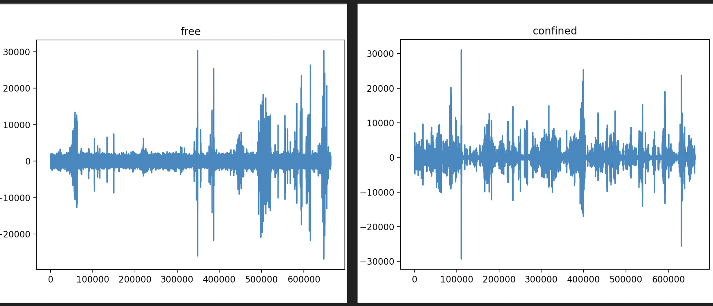
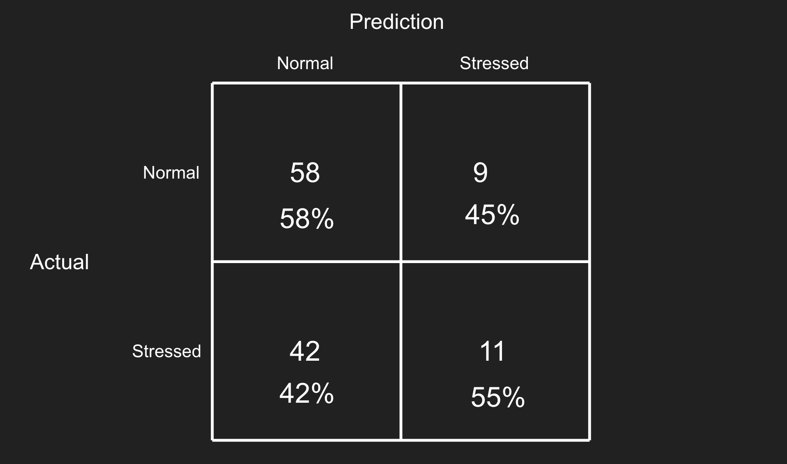

# Detecting Stress in a Flock of Chickens

All data was collected manually on five chickens of varied breeds. Fig 1. displays some representative examples.

_Figure 1. Sample data from recordings of free chickens (left) and confined chickens (right)_

Two classification models were tested: a K-nearest neighbors and a neural network. The results for the neural network are shown in Fig. 2 below. 

_Figure 2. Confusion matrix for the neural network model_

Additional time-consuming data collection is necessary to improve these results.
